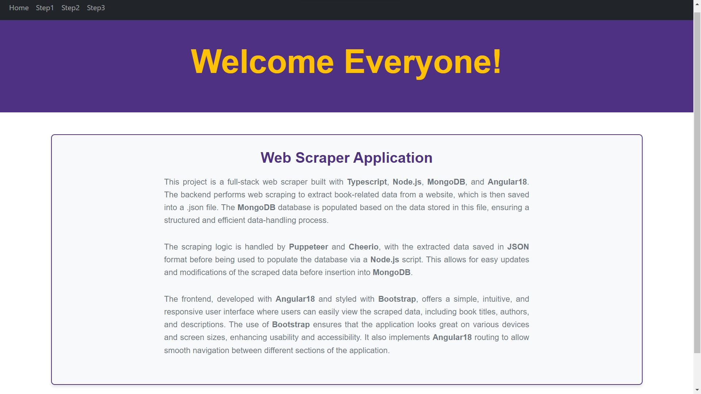

# Web Scraper Project

## Overview Backend

The backend of this project is built using **Node.js**, **TypeScript**, **Express**, and **MongoDB**. It handles scraping data from the [Books to Scrape](https://books.toscrape.com/) website, storing the scraped information in a .json file and after that the file is used to populate a MongoDB database, and providing an API for interacting with the data.
### Key Files and Their Functions

#### 1. **`app.ts`**

This file initializes the **Express** application, configures middleware, and connects to the **MongoDB** database.

- **Dependencies**: 
  - **`express`**: Framework for building web applications.
  - **`cors`**: Middleware for enabling Cross-Origin Resource Sharing.
  - **`mongoose`**: ODM (Object Data Modeling) library for MongoDB.

- **Key Functions**:
  - Set up middleware for handling **CORS** and **JSON** requests.
  - Connect to the **MongoDB** database using **Mongoose**.
  - Start the **Express** server on the specified port.

#### 2. **`scraper.ts`**

This file contains the logic for scraping book data from the target website.

- **Dependencies**:
  - **`puppeteer`**: Headless browser for automating web scraping.
  - **`cheerio`**: Library for parsing and manipulating HTML.

- **Key Functions**:
  - **`extractAdditionalBooksInfo()`**: Fetches additional details (description, UPC, availability, genre, word count) for each book by navigating to its individual page.
  - **`extractBooksInfo()`**: Extracts the main information (title, rating, price, image) for each book listed on the main page.
  - **`scrapeAction()`**: Main function to launch **Puppeteer**, navigate to the target URL, and perform the scraping.

#### 3. **`populateDb.ts`**

This file is responsible for populating the **MongoDB** database with the scraped book data.

- **Dependencies**: 
  - **`mongoose`**: Used to connect to **MongoDB** and save documents.
  - **`fs`** and **`path`**: Used to read the **`booksData.json`** file containing the scraped data.

- **Key Functions**:
  - **`populate()`**: Reads the JSON file, checks for existing books in the database, and inserts new books if they do not already exist.

#### 4. **`controllers.ts`**

Contains functions that handle incoming API requests related to book data.

- **Key Functions**:
  - **`createNewBook()`**: Creates a new book entry in the database.
  - **`readAllBooks()`**: Retrieves all book entries from the database.
  - **`updateBookById()`**: Updates an existing book entry based on the provided ID.
  - **`deleteBookById()`**: Deletes a book entry based on the provided ID.
  - **`scrapeBooks()`**: Initiates the scraping process and returns a response upon completion.
  - **`populateDataBaseBooks()`**: Populates the database with the scraped book data.

#### 5. **`routesBooks.ts`**

Defines the API endpoints for managing book data.

- **Endpoints**:
  - **`POST /books`**: Endpoint for creating a new book.
  - **`GET /books`**: Endpoint for retrieving all books.
  - **`PUT /books/:id`**: Endpoint for updating a book by ID.
  - **`DELETE /books/:id`**: Endpoint for deleting a book by ID.
  - **`GET /books/scrape`**: Endpoint for scraping book data.
  - **`POST /books/populate`**: Endpoint for populating the database with scraped data.

### Database Structure

The database uses **MongoDB** to store book information. Each book document has the following fields defined in the **`bookModel.ts`** file:

- **`imageSrc`**: URL of the book's cover image.
- **`ratingConverted`**: Numerical rating of the book (required).
- **`titleName`**: Title of the book (required and unique).
- **`priceValue`**: Price of the book (required).
- **`signOfGBP`**: Currency sign (optional).
- **`fullLink`**: URL to the book's detail page.
- **`description`**: Description of the book (optional).
- **`UPC`**: Universal Product Code of the book (optional).
- **`stock`**: Number of copies available (optional).
- **`genre`**: Genre of the book (optional).
- **`wordsNumber`**: Word count of the book's description (optional).

## Overview Frontend

This documentation outlines the structure, components, and functionality of the frontend application for the web scraper project developed using **Angular_18**. The application is designed to scrape, populate database, fetch, display, update, and delete book-related data.
## Responsiveness and UI Design

The frontend application is built with a responsive design in mind, ensuring that it provides a seamless user experience across various devices and screen sizes. It utilizes **Bootstrap**, a popular CSS framework, to create a visually appealing layout and to implement responsive components. This enables easy navigation and interaction for users, regardless of whether they are accessing the application on a desktop, tablet, or mobile device.

## Preview of Frontend Application



## Key Components

### `app.component.ts`

The root component of the Angular application, `AppComponent` serves as the main entry point. 

- **Imports**:
  - `RouterOutlet` and `RouterLink` are used for handling navigation and routing within the application.
  - `HeaderComponent`, `FooterComponent`, and `HomeComponent` are included to structure the layout of the application.

- **Template and Styles**:
  - The component's HTML structure is defined in `app.component.html`.
  - Styles are applied from `app.component.css`.

### `book.service.ts`

The `BookService` class provides a set of methods for interacting with the backend API to manage book data. 

- **Methods**:
  - `scrapeBooks()`: Initiates a request to scrape books from a specified API endpoint.
  - `populateDatabaseFromJSON()`: Sends a POST request to populate the database from a JSON file.
  - `readBooks()`: Fetches a list of books from the API.
  - `deleteBook(bookId: string)`: Sends a DELETE request to remove a specific book based on its ID.
  - `updateBook(bookId: string, updatedBook: any)`: Updates the details of a specific book.

### `tutorial.component.ts`

The `TutorialComponent` introduces users to the scraping functionality of the application and guides them through the scraping process.

- **Properties**:
  - `successMessage`: Displays a message indicating successful scraping.
  - `errorMessage`: Displays an error message if there is an issue during scraping.

- **Constructor**: Injects `Router` for navigation and `BookService` for API interactions.

- **Methods**:
  - `scrapeForBooks()`: Initiates the scraping process by calling the `scrapeBooks` method from `BookService`. It handles both success and error responses, updating the corresponding message properties.
  - `goToNextStep()`: Navigates to the next step (Step 2) in the process.
  
### `step2.component.ts`

The `Step2Component` is responsible for populating the database with book data from a JSON file and navigating between steps.

- **Properties**:
  - `successMessage`: Displays a message upon successful database population.
  - `errorMessage`: Displays an error message if there is an issue populating the database.

- **Constructor**: Injects `Router` for navigation and `BookService` for API interactions.

- **Methods**:
  - `populateDataBase()`: Calls the `populateDatabaseFromJSON` method from `BookService`, handling success and error responses.
  - `goToNextStep()`: Navigates to the next step in the process.
  - `goToPreviousStep()`: Navigates to the previous step in the tutorial.

### `step3.component.ts`

The `Step3Component` manages the display of books, deletion of books, and updating book details.

- **Properties**:
  - `successMessage`: Displays a message upon successful operations (fetching, deleting, or updating).
  - `errorMessage`: Displays an error message if there is an issue with the operations.
  - `books`: An array to hold the fetched book data.
  - `areBooksVisible`: A flag to toggle the visibility of the book list.
  - `selectedBook`: Holds the details of the book currently selected for updating.

- **Constructor**: Injects `Router` for navigation and `BookService` for API interactions.

- **Methods**:
  - `fetchBooks()`: Calls the `readBooks` method from `BookService` to fetch and display the list of books.
  - `deleteBook(bookId: string)`: Calls the `deleteBook` method from `BookService`, removing a book from the displayed list upon success.
  - `toggleUpdateForm(book: any)`: Opens or closes the update form for a selected book.
  - `closeUpdateForm()`: Closes the update form.
  - `submitUpdateBook()`: Calls the `updateBook` method from `BookService` to save changes to the selected book.


### Cloning the Repository

To clone the repository and run the backend server, follow these steps:

1. **Clone the repository**:
   ```bash
   git clone https://github.com/GengiuRobert/Web-Scraper-TS.git
2. **Navigate to the project directory for backend**:
   ```bash
   cd web-scraper
3. **Install the dependencies for backend**:
   ```bash
   npm install
4. **Start the backend server**:
   ```bash
   npm start
5. **Backend server link**:
   ```bash
   http://localhost:4000/
6. **Navigate to the project directory for frontend**:
   ```bash
   cd web-scraper
   cd ./frontend/src/app
7. **Install the dependencies for frontend**:
   ```bash
   npm install
8. **Start the frontend server**:
   ```bash
   ng serve
9. **Frontend server link**:
   ```bash
   http://localhost:4200/
